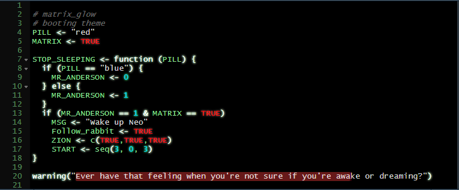
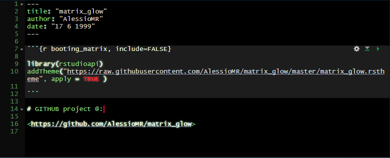
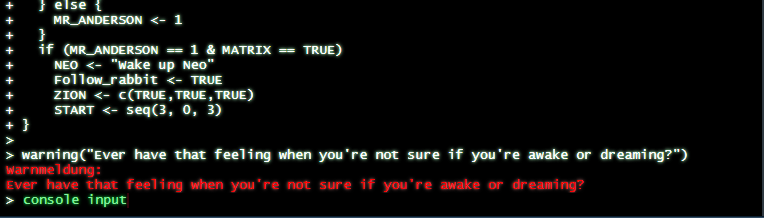

# matrix_glow
A custom theme for Rstudio v1.2+ in the style of the film Matrix (1999) inspired by @jnolis [Synthwave85](https://github.com/jnolis/synthwave85) theme.

## Preview:

**RScript:**




**Markdown document:**




**Console:**



This is a purely cosmetic theme for RStudio. Some people might find it hard to read the script, because of "glowing" operators and keywords. This can be turned off by removing every line in the .rstheme file that starts with "text-shadow:".

---


## Installation

There are two ways to apply the matrix_glow theme to RStudio:
  - Download the file "matrix_glow.rstheme" -> Open RStudio and go to: Tools - Global Options - Appearance.  Click on Add and select "matrix_glow.rstheme" from your download directory and apply.
  
**OR**
  
  - Run the following code in R:
  
    To install the necessary package
    ```
    install.packages("rstudioapi") 
    ```
    To load the necessary package
    ```
    library(rstudioapi) 
    ```
    To download the theme and apply it.
    ```
    addTheme("https://raw.githubusercontent.com/AlessioMR/matrix_glow/master/matrix_glow.rstheme", apply = TRUE ) 
    ```


## BUGS

If you spot awful looking colors please raise a GitHub issue. I will keep this theme updated. Due to the nature of .rstheme files it is not immediately visible for me whether everything is colored accodingly. I am open to any new ideas and suggestions also.

*Have fun in the matrix*
